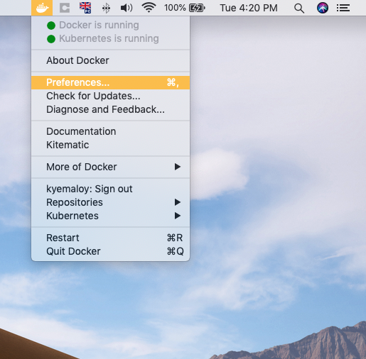
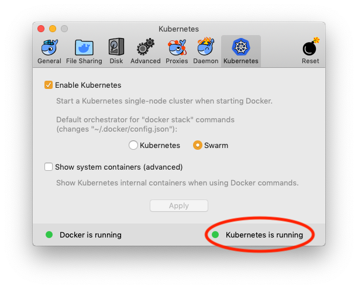
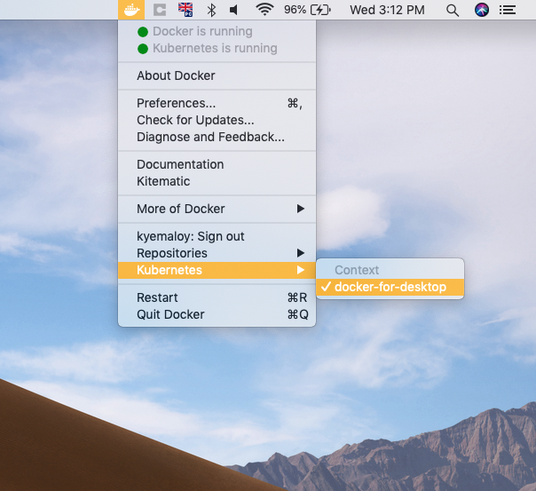

# Deploying to Kubernetes using Docker and Helm

Everything we have built so far has run locally on macOS. Using the Helm charts generated by `kitura init`, along with Docker for Desktop's Kubernetes support, will allow us to deploy to a local Linux cluster. This mimics deploying to a cloud environment such as IBM Cloud, where we would gain support for scaling our app depending on demand, failover to keep our app running smoothly if anything goes wrong, load balancing, rolling updates and more!

## Pre-Requisites

This is a follow on from the previous tutorial, [Adding persistance to ToDoBackend with Swift-Kuery-ORM](https://github.com/IBM/ToDoBackend/blob/master/DatabaseWorkshop.md).

In this section you will learn about:

* Installing Docker for Desktop
* Installing Helm

Ensure you have installed [Docker for Desktop](https://www.docker.com/products/docker-desktop) on your Mac and enabled Kubernetes within the app. To do so, select the docker icon in the Menu Bar and click Preferences > Kubernetes Tab > Enable Kubernetes. It will take a few moments to install and start up, but when the indicator light in the bottom right corner is green, you're ready to go!





You are also going to need to install Helm using brew. Enter the following into your Terminal:

```bash
brew install kubernetes-helm
```
**Note:** if you get an error at this stage referencing a URL containing `kube`, then you already have Kubernetes installed on your system and are now running with multiple contexts. For the purposes of this workshop, change to the Kubernetes context by accessing Docker's menubar dropdown (not prefences like before), going into Kubernetes and under context, `select docker-for-desktop`.



## Deploying a PostgreSQL database instance

In this section you will learn about:

* Adding repos to Helm

- Create a PostgreSQL release

The entire application will consist of two Pods (a Kubernetes Pods, not a CocoaPods), one for the database and one for the Kitura server running your Swift code. We will start by deploying a PostgreSQL release to your local Kubernetes cluster using a Helm chart. 

**Note:** A Helm chart `install` to Kubernetes is called a **release**, and each release lives within a Kubernetes **Pod**.

### Adding repos to Helm

Helm has a repo named `stable` which has a load of commonly used charts (blueprints to things you might want to run in a cluster, like databases!), but we need to tell Helm where to look for these blueprints.

```bash
helm init #Initialises Helm on our newly created Kubernetes cluster
helm repo add stable https://kubernetes-charts.storage.googleapis.com
```

### Creating the release 

We can now create a PostgreSQL release called `postgresql-database`. 

**Note**: Kubernetes and Helm are very specific on names, and calling your database anything else will result in later parts of the tutorial requiring tweaking.

```bash
helm install --name postgresql-database --set postgresDatabase=tododb,postgresPassword=p4ssw0rd stable/postgresql
```

*The `--set` flag tells Helm to set some values during the `install` process. For PostgreSQL, we can specify a database we want created. We call that database `tododb` to match the name already in our Swift code from the last tutorial. We also set the database password to be the **extremely secure** value of `p4ssw0rd`.*

We now have a database called `tododb` inside your Docker container, running within your local Kubernetes cluster. Well done!

## Edit the Swift code

### Edit the Swift code for connection to Kubernetes

Your Swift code is going to need some minor changes to reflect using a database inside the local cluster. All the changes are happening in the declaration within your `Persistence` class in `Application.swift`, inside the `let pool` assignment.

Change `host:` from `localhost` to `postgresql-database`. Keep port as `5432`

Leave `.databaseName("tododb") ` as it is. Add `.password("p4ssw0rd")` and `.userName("postgres")`. Make sure each element is separated with a comma, and all the values you entered are type `String`. 

These changes allow the Kitura sever to access the database and write/read data from it.

Your changes should look like this:

```swift
let pool = PostgreSQLConnection.createPool(host: "postgresql-database", port: 5432, options: [.databaseName("tododb"), .password("p4ssw0rd"), .userName("postgres")], poolOptions: ConnectionPoolOptions(initialCapacity: 10, maxCapacity: 50, timeout: 1000))
```

## Docker

In this section you will learn how to:

- Modifying the Dockerfile and Dockerfile-tools
- Create a build image
- Create a run image
- Tagging the run image

### Modify your Dockerfile and Dockerfile-tool

We are now ready to compile your code and create a Docker image, ready to deploy to your local cluster. `kitura init` provides us with a skeleton Dockerfile, but we need to add the PostgreSQL system libraries for our Swift project to use. Open up Dockerfile and change the line

```
# RUN apt-get update && apt-get dist-upgrade -y
```
and modify it to say the following. Make sure to remove the comment in front of `RUN`
```dockerfile
RUN sudo apt-get update && apt-get install -y libpq-dev
```

Repeat the same for `Dockerfile-tools`. When you have completed this, we can build our images. 

### Building your images

First we need to build a Docker image to hold our build toolchain. This includes the Swift compiler, along with other components and has a larger storage footprint. By splitting the executable run image and the build image up, our run image is significantly smaller. 

If we were to upload our run image Docker Hub, we would therefore use less of our storage quota. The run image actually makes itself even smaller by removing unnecessary system files, such as `man` pages.

```
docker build -t server-build -f Dockerfile-tools .
```
We now run the build image, which compiles our Swift code. This creates the Linux executable in the process, and saves it to a new local directory on our Mac called `/swift-project`.
```
docker run -v $PWD:/swift-project -w /swift-project server-build /swift-utils/tools-utils.sh build release
```
Now it's time to build an image to copy our local Linux executable into, minus any build artifacts. This image would be uploaded to Docker Hub if we chose to do so. It fetches the executable from `/swift-project`.
```
docker build -t server-run .
```
### Tagging your image for use with Helm

Finally, we need to tag the image so we can point our Helm chart at it.

```bash
docker tag server-run:latest server-run:1.0.0
```

Now our `server-run` docker image contains our executable which can be deployed to Kubernetes using the Helm chart that `kitura init` provided us with!

## Deploy with Helm

In this section you will learn about:

- Deploying the Docker container into Kubernetes using a local Helm chart
- Accessing the OpenAPI dashboard from a browser with port forwarding

### Using Helm charts to deploy to Kubernetes

First we must edit the chart that will be used to deploy to Kubernetes to point to our local, tagged `server-run` image. Using Xcode's left sidebar, navigate to chart > ToDoServer > values.yaml.

This acts like a blueprint for Helm to use when deploying our application to Kubernetes. We need to modify the `repository`, `tag` and `pullPolicy` lines (towards the top of the file). 

**Caution:** make sure your indentation is consistent with the rest of the file, and YAML does not support tabs so use spaces instead!

```yaml
...
image:
    repository: server-run
    tag: 1.0.0
    pullPolicy: IfNotPresent
...
```

We are telling Helm to use a local Docker image called `server-run` tagged at `1.0.0`, and to only pull from a remote if we can't find the image locally.

We are now ready to deploy our Helm chart into Kubernetes.

```bash
helm install --name server chart/ToDoServer
kubectl get all #Ensure the pod todoserver-deployment STATUS is Running
```

Now everything is up and running! To access the database, we will use the OpenAPI UI route.

### Accessing the Application from a browser

We can't navigate to `localhost:8080` as usual because our cluster isn't part of the localhost network. Port forwarding is built into the `kubectl` tools, and allows us to access our application from a browser as usual.

```bash
kubectl get pods #Copy the todoserver NAME
kubectl port-forward <todoserver-deployment-XXXXXX-XXXXX> 8080:8080
```

We can now open a browser, and go to [localhost:8080/openapi/ui](localhost:8080/openapi/ui) where the OpenAPI dashboard should display. Using the drop down menus, select `POST /` and click the Example Value on the right hand side to autofill the input field. Now select `Try it out!` and a `201` response should be recieved (you may need to scroll down to see it).

Now try `GET /` and the response should `200` and the Response Body should contain the ToDo we just posted to the server. Kitura is accessing a database running in a Kubernetes Cluster, while itself is running in the same cluster!

## Cleaning up

Finally, we will:

- Delete Helm releases
- Delete local Docker images
- Turn off your local Kubernetes cluster

We now have a few things locally that are taking up disk space, including about 2.4GB of Docker images as well as a running cluster which is using system resources. Delete both the database and the kitura server from the cluster.

```bash
helm delete --purge server && helm delete --purge postgresql-database
```

We can now delete our local Docker images from the system to reclaim the lost hard drive space.

```bash
docker image list #We will need the IMAGE ID values
docker image rm -f IMAGE-ID #Repeat on the IMAGE ID of both your run and build images
```

We have now stopped the releases running in the Kubernetes cluster, and deleted their respective Docker images from the system.

The final step is to open up the Docker for Desktop application preferences from the Docker Menubar icon and uncheck the Enable Kubenetes box under the Kubernetes tab. This stops your local cluster from running.

## Next Steps 🎉

Congratulations! We have learnt about Docker, Helm and Kubernetes and deployed our own releases to the local cluster. Here are some ideas you could explore to further your learning.

* Push your Kitura image to Docker Hub (or another container registry)
* Have Helm pull your Kitura app from Docker Hub instead of using your local image
* Deploy your Kitura app to the IBM Kubernetes Service on IBM Cloud

## Tips for Kubernetes and Helm

For logs on the running Pods, use

```
kubectl log --timestamp=true --follow=true <POD-NAME>
```

This will create a streaming output of the logs created by the pod. This works well if you are having issues connecting to the database, for example. You could have logs from the database streaming as you accessed the todoserver on the port-forwarded port 8080, and get realtime feedback on what the server is reporting.

To delete an individual deployment created with Helm

```bash
helm list #Note the exact name (same one you chose when you ran helm install)
helm delete --purge HELM-NAME
```

Without including `--purge`, the name of the instance is not freed and if you ran `helm install` again using the same name, you could recieve an error.

You can also abbreviate `helm delete` to `helm del` .

