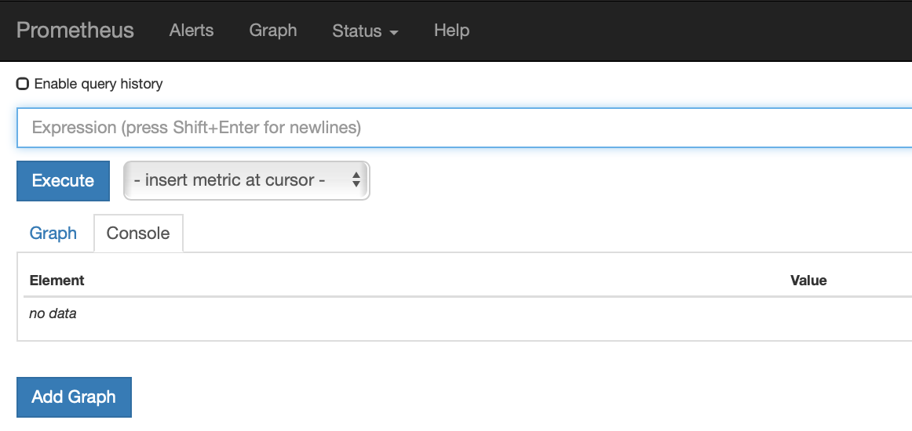
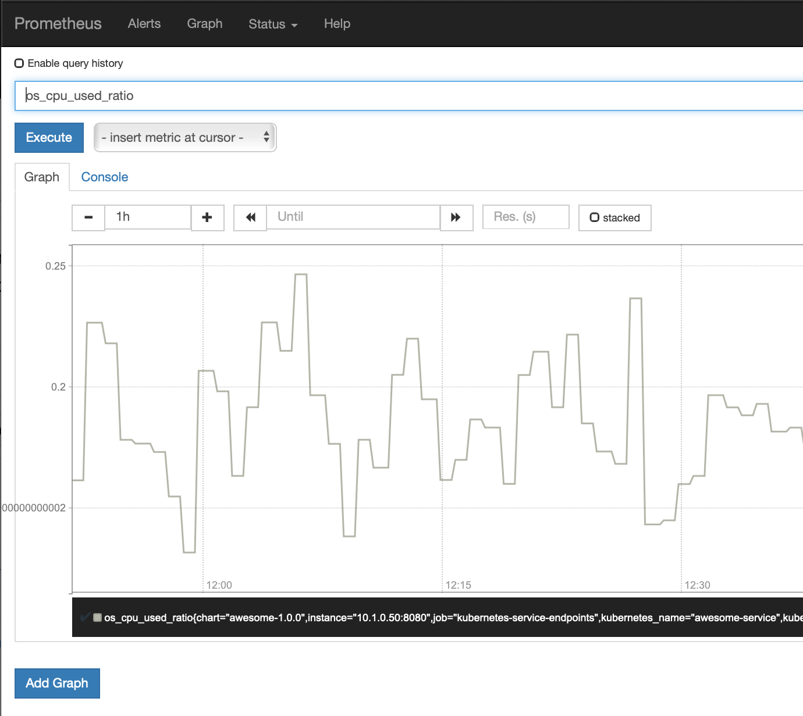
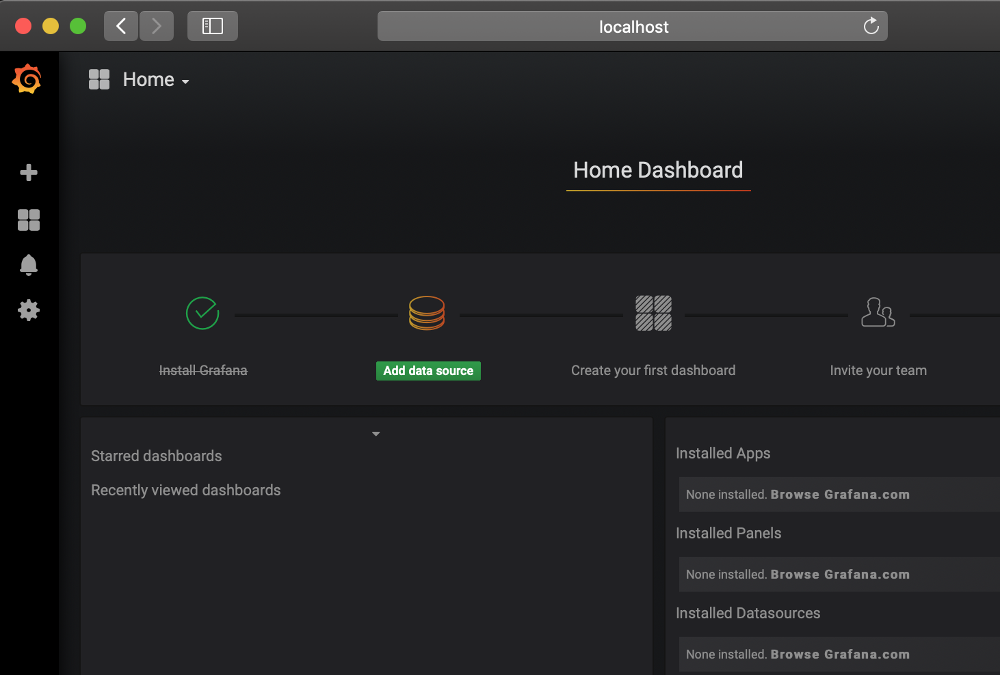
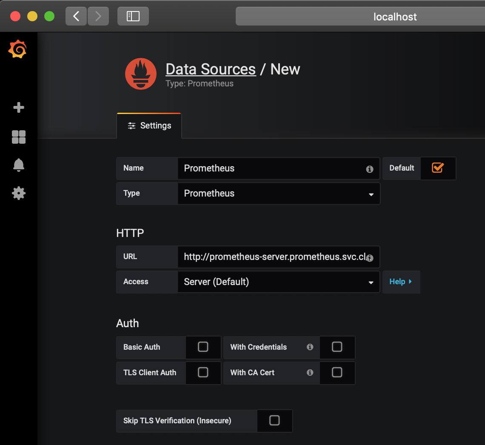
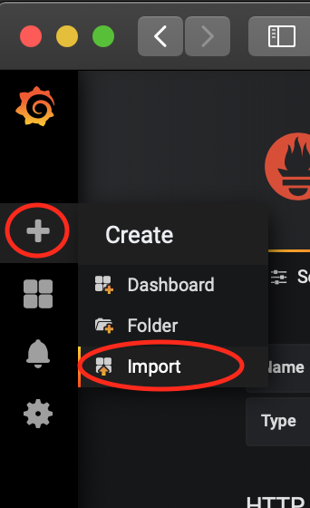
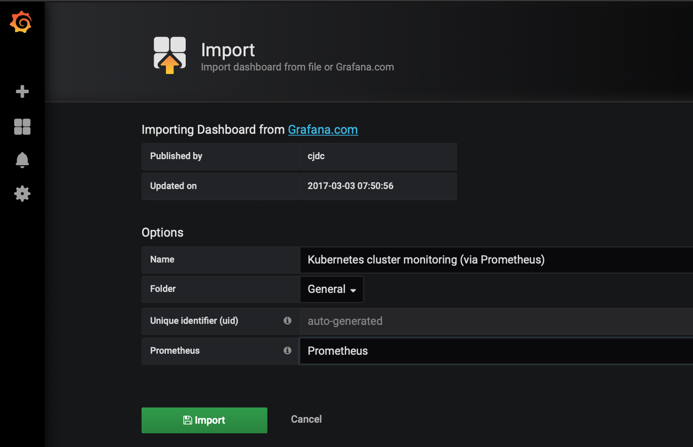
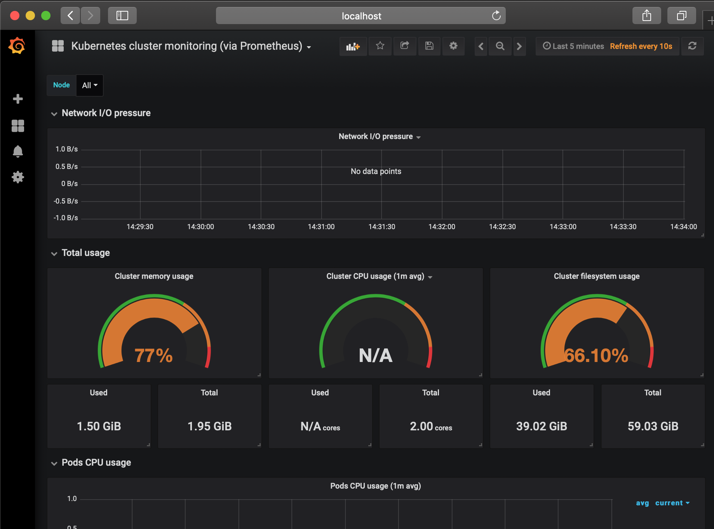
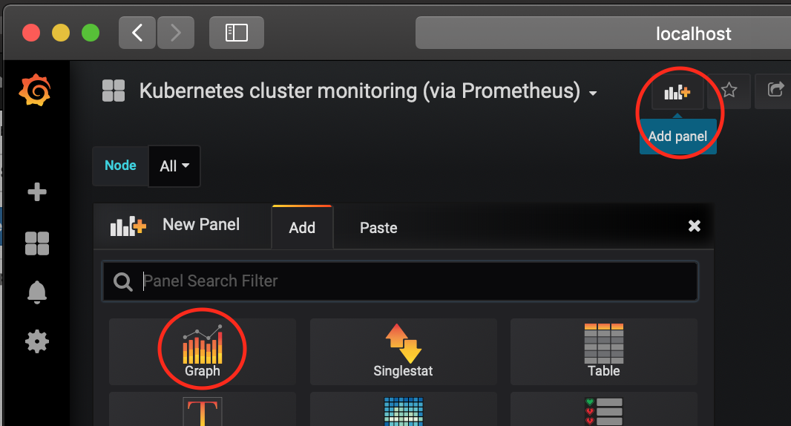

# Monitoring the ToDoBackend in Kubernetes

Kitura uses the SwiftMetrics module to provide monitoring data, covering metrics like CPU usage, memory usage and HTTP responsiveness.

SwiftMetrics provides APIs for accessing the monitoring data, as well as providing built-in integration with the Prometheus open source monitoring tool.

Whilst Prometheus can be run anywhere, it is also designed to integrate easily in a Kubernetes enviroment, with pre-build configurations to collect data from both Prometheus compatible applications and from Kubernetes itself.

## Installing Prometheus into Kubernetes

Installing Prometheus into Kubernetes can be done using its provided Helm chart:

```sh
helm install stable/prometheus --name prometheus --namespace prometheus
```

You can then run the following two commands in order to be able to connect to Prometheus from your browser:

```sh
export POD_NAME=$(kubectl get pods --namespace prometheus -l "app=prometheus,component=server" -o jsonpath="{.items[0].metadata.name}")
kubectl --namespace prometheus port-forward $POD_NAME 9090
```
You can now connect to Prometheus at the following address:

* [http://localhost:9090](http://localhost:9090)

This should show the following screen:

Prometheus will be automatically collecting data from your Kitura application, allowing you to create graphs of your data.

To build your first graph, type `os_cpu_used_ratio` into the **Expression** box and click on the **Graph** tab:




Whilst Prometheus provdes the ability to build simple graphs and alerts, Grafana is commonly used to build more sophisticated dashboards.

## Installing Grafana into Kubernetes

Installing Grafana into Kubernetes can be done using its provided Helm chart:

```sh
helm install stable/grafana --set adminPassword=PASSWORD --name grafana --namespace grafana
```

You can then run the following two commands in order to be able to connect to Grafana from your browser:

```sh
export POD_NAME=$(kubectl get pods --namespace grafana -l "app=grafana" -o jsonpath="{.items[0].metadata.name}")
kubectl --namespace grafana port-forward $POD_NAME 3000
```
You can now connect to Grafana at the following address, using `admin` and `PASSWORD` to login:

* [http://localhost:3000](http://localhost:3000)

This should show the following screen:



In order to connect Grafana to the Prometheus service, next click on **Add data source**.

This opens the a panel that should be filled out with the following entries:

* Name: `Prometheus`
* Type: `Prometheus`
* URL: `http://prometheus-server.prometheus.svc.cluster.local`



Now click on **Save & Test** to check the connection and save the Data Source configuration.

Grafana now has access to the data from Prometheus.

## Installing a Kubernetes Dashboard into Grafana

The Grafana community provides a large number of pre-created dashboards which are available for download, including some which are designed to display Kubernetes data.

To install one of those dashboards, click on the **+** icon and select **Import**



In the provided panel, enter `1621` into the **Grafana.com Dashboard** field in order to import dashboard number 1621, and press **Tab**.

This then loads the information on dashboard `1621` from Grafana.com.

Set the **Prometheus** field to `Prometheus` and click **Import**.



This will then open the dashboard, which will automatical start populating with data about your Kubernetes cluster.



## Adding Custom Graphs

In order to extend the dashboard with your own graphs, click the **Add panel** icon on the top toolbar and select **Graph**.



This creates a blank graph. Select the **Panel Title** pull down menu and select **Edit**.

This opens an editor panel where you can select data that you'd like to graph.

Type `os_cpu_used_ratio` into the data box, and a graph of your applications CPU data will show on the panel.

You can create more complex queries and apply filters according to any kubernetes value. For example, the following will show all of the HTTP request durations for your specific application:

* `http_request_duration_microseconds{kubernetes_name="todoserver-service"}`

## Next Steps 🎉
You now have integrated monitoring for both your Kubernetes cluster and your deployed Kitura application.

Here are some ideas you could explore to further your learning.

* Add a Singlestat that shows how many instances of you Kitura application are currently running
* Add a Singlestat that shows how many requests your Kitura app has responded to 
